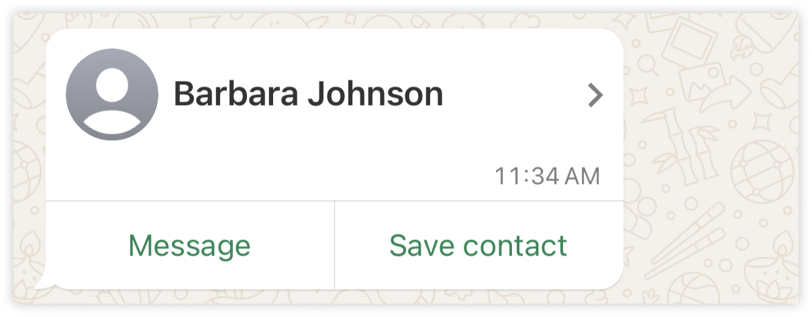
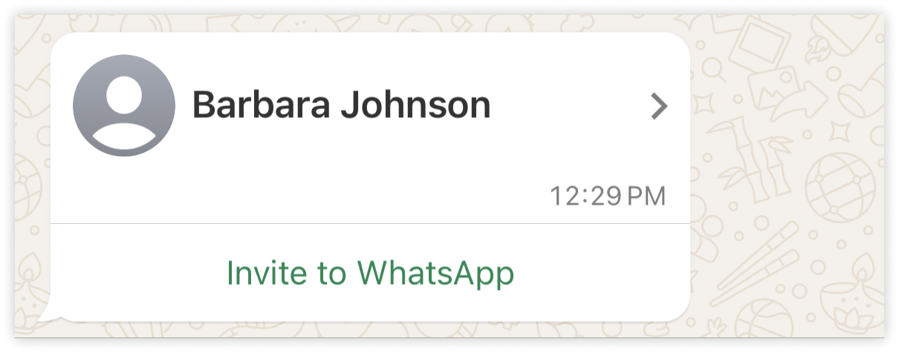

# Phone

Phone, `Warb::Components::Phone`, is a component used in the `Contact` message type.

It represents a phone with the following fields:

|Attribute | Type     | Description                                   | Required |
|----------|----------|-----------------------------------------------|----------|
| `phone`  | `String` | The phone number                              | No       |
| `type`   | `String` | The type of the phone (e.g., "HOME", "WORK" ) | No       |
| `wa_id`  | `String` | The WhatsApp ID associated with the phone     | No       |

The `wa_id` is used to identify the WhatsApp account associated with the given phone number. Generally, it is the same as the phone number, without the `+` sign.

When used, the sent message will allow the recipient to interact directly with the WhatsApp account associated with the `wa_id`:




If omitted, or without account associated to the given `wa_id`, the recipient will be able to send a WhatsApp invitation:



When using the `Warb::Components::Phone` component directly, you can set these attributes in the initializer or by assigning them directly to the instance.

```ruby
phone = Warb::Components::Phone.new(
  phone: "+1234567890",
  type: "WORK",
  wa_id: "1234567890"
)
```

or

```ruby
phone = Warb::Components::Phone.new
phone.phone = "+1234567890"
phone.type = "WORK"
phone.wa_id = "1234567890"
```

But it is better to use it in the context of a `Contact` message type, where you can add phones using the `add_phone` method:

```ruby
Warb.contact.dispatch(recipient_number) do |contact|
  # Adding a phone using a block
  contact.add_phone do |phone|
    phone.phone = "+1234567890"
    phone.type = "WORK"
    phone.wa_id = "1234567890"
  end

  # Adding a phone with parameters
  contact.add_phone(phone: "+0987654321", type: "HOME", wa_id: "0987654321")
end
```